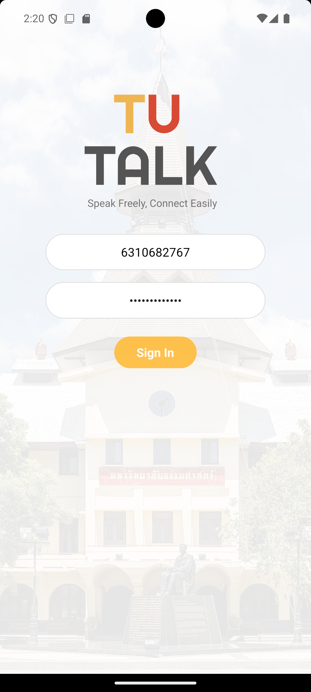
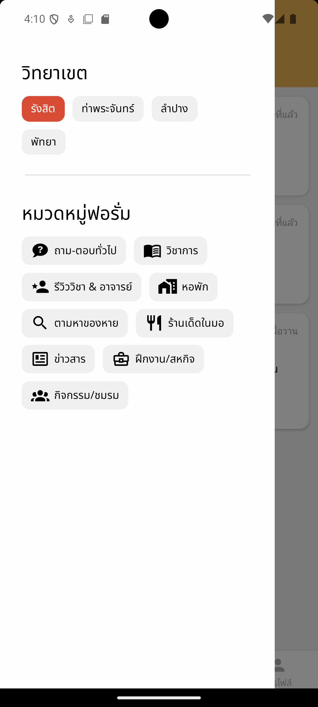
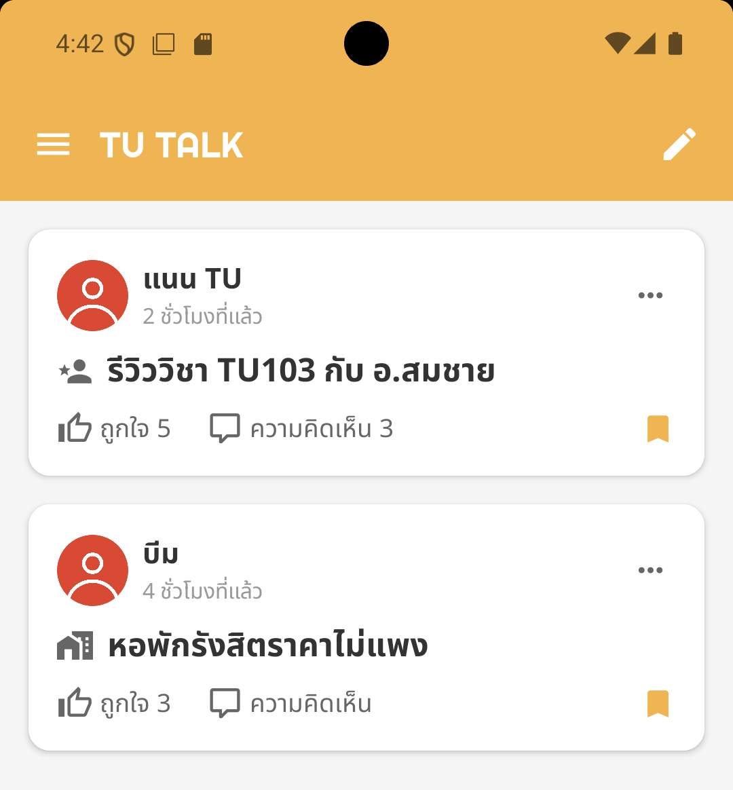
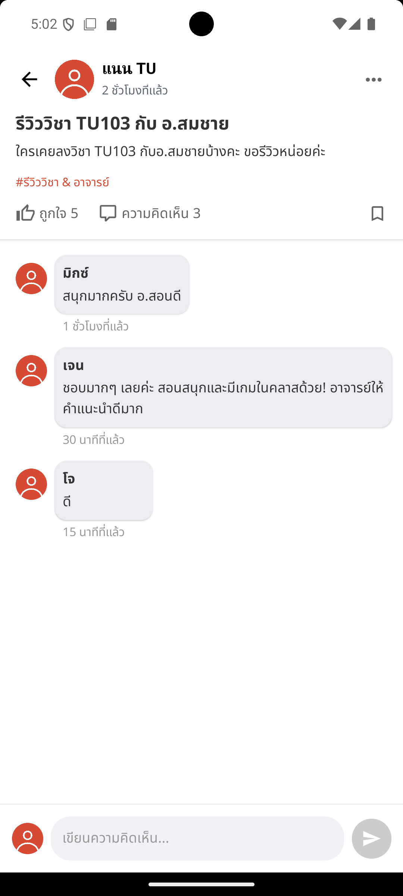
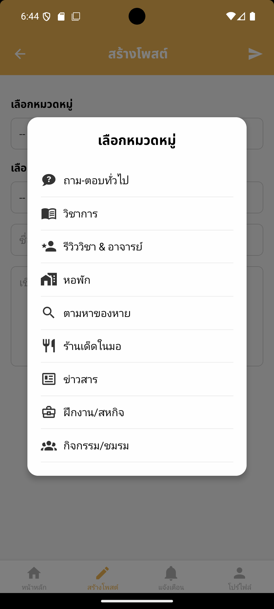
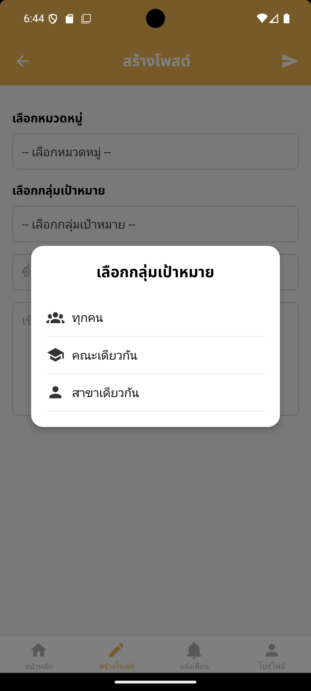
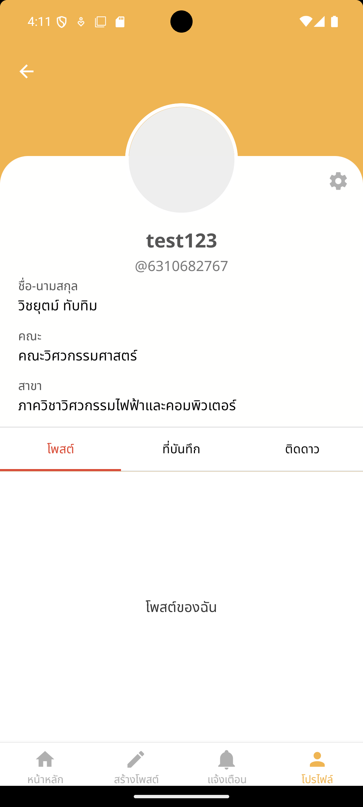
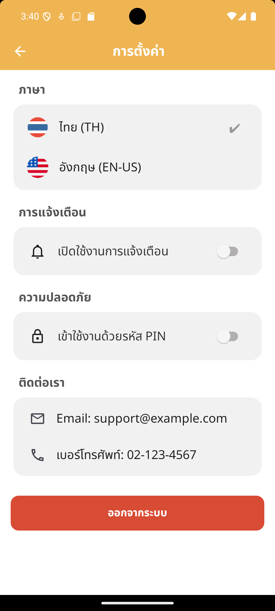

# TU TALK 📱💬

TU TALK is a cross-platform social networking application that allows users to create, share, and interact with posts.

The application is built using React Native with Expo for the frontend and Node.js with Express for the backend. It provides a social media experience where users can create posts, upload images, explore content, and manage their profiles.

This project was developed as a university group project by Computer Engineering students.

---

# 📌 Project Overview

Social networking platforms require efficient content sharing, user interaction, and data management.

TU TALK provides a mobile-first social platform that enables users to:

- Create and publish posts
- View and explore community content
- Upload images
- Manage user accounts
- Interact with posts
- Navigate through a modern mobile interface

The application supports multiple platforms:

- iOS
- Android
- Web

using a single React Native codebase.










---

# ✨ Features

## 🔐 Authentication System

Users can:

- Register accounts
- Login and logout
- Maintain authentication sessions
- Access protected features

Authentication workflow:

```
User
 |
 v
Login / Register
 |
 v
Express API
 |
 v
JWT Authentication
 |
 v
Protected Resources
```


## 📝 Post Management

Users can:

- Create posts
- Upload images
- View post feeds
- Explore content
- View post details

Post images are uploaded and stored using Firebase Storage.


## 🧭 Navigation System

The application uses Expo Router for navigation.

Application structure:

```
Application

├── Authentication
│   ├── Login
│   └── Register
│
├── Main Tabs
│   ├── Home Feed
│   ├── Create Post
│   ├── Notifications
│   └── Settings
│
└── Post Details
```


## 🎨 User Interface

The application provides:

- Reusable UI components
- Responsive layouts
- Mobile-friendly navigation


## 🗂 State Management

Client-side state management is handled using Zustand.

Managed states:

- Authentication state
- User session
- Feed data
- Post creation data

State persistence is implemented using AsyncStorage.

---

# 🛠 Tech Stack

## Frontend

- TypeScript
- JavaScript
- React Native
- Expo 52
- Expo Router
- NativeWind (Tailwind CSS)

## Backend

- Node.js
- Express 5

## Database

- MongoDB

## Storage

- Firebase Storage

## Libraries

- Axios
  - HTTP client communication

- Mongoose
  - MongoDB ODM

- Zustand
  - State management

- Firebase Admin
  - Firebase backend integration

---

# 📂 Project Structure

```
TU-TALK/

├── app/
│   ├── (auth)/
│   │   └── Authentication screens
│   │
│   ├── (tabs)/
│   │   ├── Home feed
│   │   ├── Create post
│   │   ├── Notifications
│   │   └── Settings
│   │
│   ├── modals/
│   │   └── Modal screens
│   │
│   ├── post/
│   │   └── Post details
│   │
│   ├── _layout.tsx
│   │   └── Root navigation configuration
│   │
│   └── firebaseConfig.js
│       └── Firebase initialization
│
├── backend/
│   └── src/
│       ├── app.js
│       │   └── Express application setup
│       │
│       ├── server.js
│       │   └── Server entry point
│       │
│       ├── routes/
│       │   └── API endpoints
│       │
│       ├── controllers/
│       │   └── Business logic
│       │
│       ├── models/
│       │   └── MongoDB schemas
│       │
│       ├── middleware/
│       │   └── Authentication and validation
│       │
│       ├── config/
│       │   └── Configuration files
│       │
│       └── utils/
│           └── Helper functions
│
├── components/
│   ├── SlidebarMenu.tsx
│   ├── PostFilterMenu.tsx
│   ├── PostImagePicker.tsx
│   ├── ThemedText/View.tsx
│   └── ui/
│       └── Shared components
│
├── stores/
│   ├── useAuthStore.ts
│   ├── useFeedStore.ts
│   └── useCreatePostStore.ts
│
├── hooks/
│   ├── usePost.ts
│   ├── useColorScheme.ts
│   └── useThemeColor.ts
```

---

# 🏗 System Architecture

TU TALK follows a client-server architecture.

System workflow:

```
React Native Application
          |
          |
       Axios HTTP
          |
          v
Node.js + Express API
          |
          |
      Mongoose ODM
          |
          v
MongoDB Database
```

Image Upload Flow:

```
User selects image

        |
        v

React Native Application

        |
        v

Firebase Storage

        |
        v

Image URL saved in MongoDB
```

---

# 📊 API Architecture

Backend API structure:

```
backend/src/

routes/

├── auth
│   └── Authentication APIs
│
└── posts
    └── Post management APIs
```

Request flow:

```
Route
 |
 v
Controller
 |
 v
Model
 |
 v
MongoDB
```

---

# 🎯 Learning Outcomes

Through this project, we gained experience in:

- Developing cross-platform mobile applications
- Building RESTful APIs
- Designing client-server architecture
- Using React Native with TypeScript
- Managing application state with Zustand
- Designing MongoDB database schemas
- Implementing JWT authentication
- Integrating Firebase Storage
- Creating reusable UI components
- Connecting frontend and backend systems

---

# 👨‍💻 Contributors

University group project developed by Computer Engineering students.

| Student ID | Name |
|---|---|
| 6310540015 | กิตติพัฒน์ มะลิซ้อน |
| 6310682767 | วิชยุตม์ ทับทิม |
| 6510615146 | นัชชานนท์ โปษยาอนุวัตร์ |
| 6510615245 | พลอยพรรณ เต็งประยูร |
| 6510615278 | วงศธร ดีโรจนวงศ์ |

---

# 📌 Future Improvements

Possible improvements:

- Add real-time chat using WebSocket
- Add push notifications
- Add theme-aware components
- Improve recommendation system
- Deploy backend to cloud infrastructure
- Add automated testing
- Improve security and API validation
